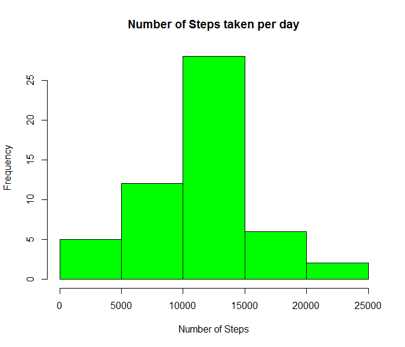
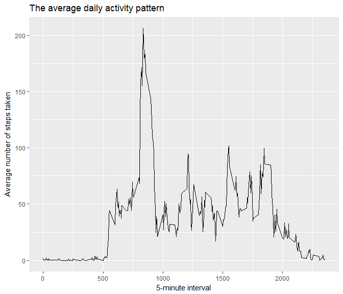
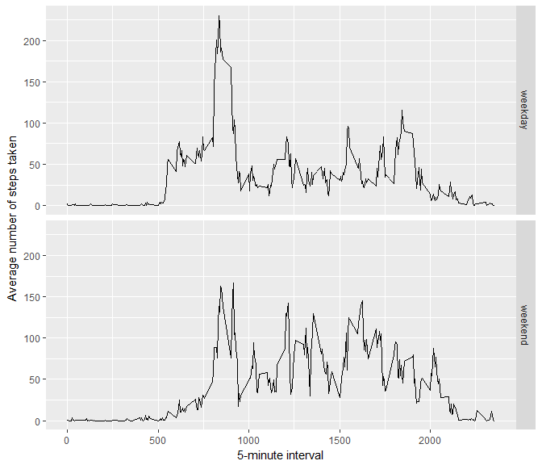

## Loading and preprocessing the data

```r
setwd("~/DataScience/R_Research/RepData_PeerAssessment1")
unzip("activity.zip", exdir = getwd())
Activity_Data <- read.csv("C:/Users/Caremecc/Documents/DataScience/R_Research/RepData_PeerAssessment1/activity.csv", header = TRUE)
```


## What is mean total number of steps taken per day?
###1. Total number of steps taken per day.

```r
tSteps <- sum(Activity_Data$steps, na.rm = TRUE)
tSteps
```

```
## [1] 570608
```
###2. Histogram of the total number of steps taken each day.

```r
##calculating and storing the total number of steps in to the variable "tSteps"
tSteps <- aggregate(steps ~ date, data = Activity_Data, FUN = sum, na.rm = TRUE)

##Generate the histogram of the total number of steps taken each day.
hist(tSteps$step, xlab = "Number of Steps", main = "Number of Steps taken per day", col = "green")
```

<!-- -->

###3. Calculate and report the mean and median of the total number of steps taken per day

```r
##Mean number of steps
tSteps_mean <- mean(tSteps$steps)

##Mean number of steps
tSteps_median <- median(tSteps$steps)

tSteps_mean
```

```
## [1] 10766.19
```

```r
tSteps_median
```

```
## [1] 10765
```

## What is the average daily activity pattern?
###1. Time series plot (i.e. type = "1") of the 5-minute interval (x-axis) and the average number of steps taken, averaged across all days (y-axis)

```r
library(ggplot2)
five_min_interval <- aggregate(steps ~ interval, data = Activity_Data, FUN = mean, na.rm = TRUE)
ggplot(data = five_min_interval, aes(x = interval, y = steps)) +
  geom_line() + 
  ggtitle("The average daily activity pattern") +
  xlab("5-minute interval") +
  ylab("Average number of steps taken")
```

<!-- -->


```r
MaxSteps <- five_min_interval[which.max(five_min_interval$steps),]

MaxSteps
```

```
##     interval    steps
## 104      835 206.1698
```

## Imputing missing values
### 1. Calculate and report the total number of missing values in the dataset 


```r
total_NA <- sum(is.na(Activity_Data$steps))

total_NA
```

```
## [1] 2304
```

### 2. Strategy for filling in all of the missing values in the dataset.
The missing value will be imputted into the dataset using the 5 day average of the respective 5 minute interval.

### 3. Create a new dataset that is equal to the original dataset but with the missing values filled in. 
### Imputting the missing values in to the dataset.


```r
imputted_act_Data <- transform(Activity_Data, steps = ifelse(is.na(Activity_Data$steps), five_min_interval$steps[match(Activity_Data$interval, five_min_interval$interval)],
                                                             Activity_Data$steps))
```

### 4. Make a histogram of the total number of steps taken each day and calculate and report the mean and median total number of steps taken per day.


```r
New_tSteps <- aggregate(steps ~ date, data = imputted_act_Data, FUN = sum, na.rm = TRUE)

#Histogram
hist(New_tSteps$steps, xlab = "Number of Steps", main = "Number of Steps taken per day", col = "green")
```

-1.png)<!-- -->

### The values does look different in comparison to the estimates derived from the first set of data without the imputation.See results below.


```r
#Mean number of steps
NewtSteps_mean <- mean(New_tSteps$steps)

#Mean number of steps
NewtSteps_median <- median(New_tSteps$steps)

NewtSteps_mean
```

```
## [1] 10766.19
```

```r
NewtSteps_median
```

```
## [1] 10766.19
```

### The impact of the imputed values shows that the gap between the mean and median have close, they are both the same figure.

## Are there differences in activity patterns between weekdays and weekends?
### 1. Create the factor variable in the datasetwithtwo levels - "weekday" and "weekdend" indicating whether a given date is a weekday or weekend day.

```r
wday_end <- function(date) {
  day <- weekdays(date)
  if (day %in% c("Monday", "Tuesday", "Wednesday", "Thursday", "Friday"))
    return("weekday") else if (day %in% c("Saturday", "Sunday"))
      return("weekend") else stop("Invalid Date")
}

imputted_act_Data$date <- as.Date(imputted_act_Data$date)
imputted_act_Data$day <- sapply(imputted_act_Data$date, FUN = wday_end)
```

###2. Make a panel plot containing a time series plot of the 5 minute interval and the average number of steps taken, averaged across all weekday days and weekend days.

### Panel Plot

```r
wday_end_mean <- aggregate(steps ~ interval + day, data = imputted_act_Data, mean)
ggplot(wday_end_mean, aes(interval, steps)) + 
  geom_line() + 
  facet_grid(day ~ .) +
  xlab("5-minute interval") + 
  ylab("Average number of steps taken")
```

<!-- -->
